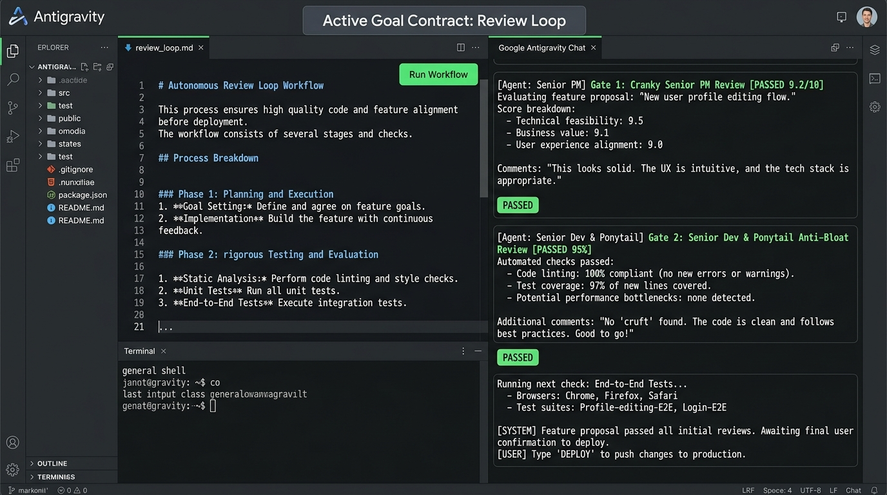
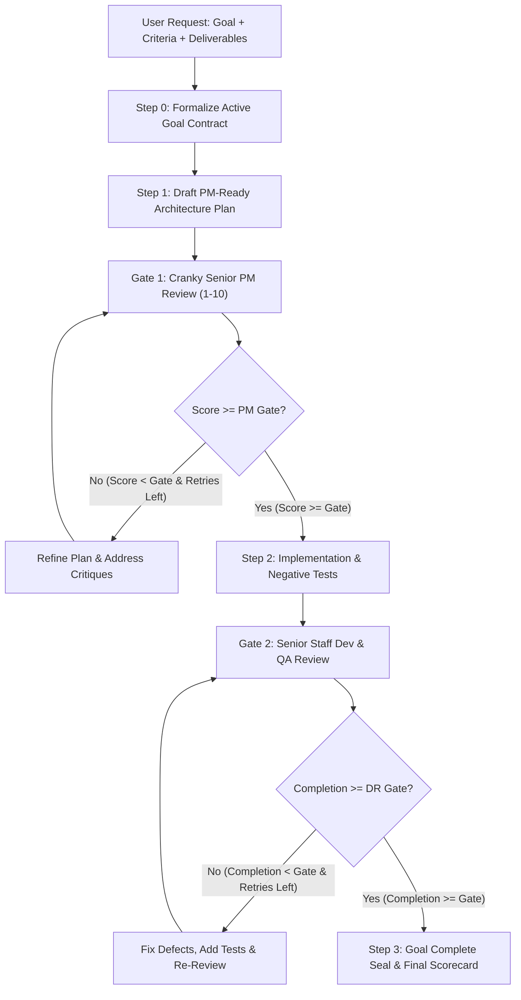
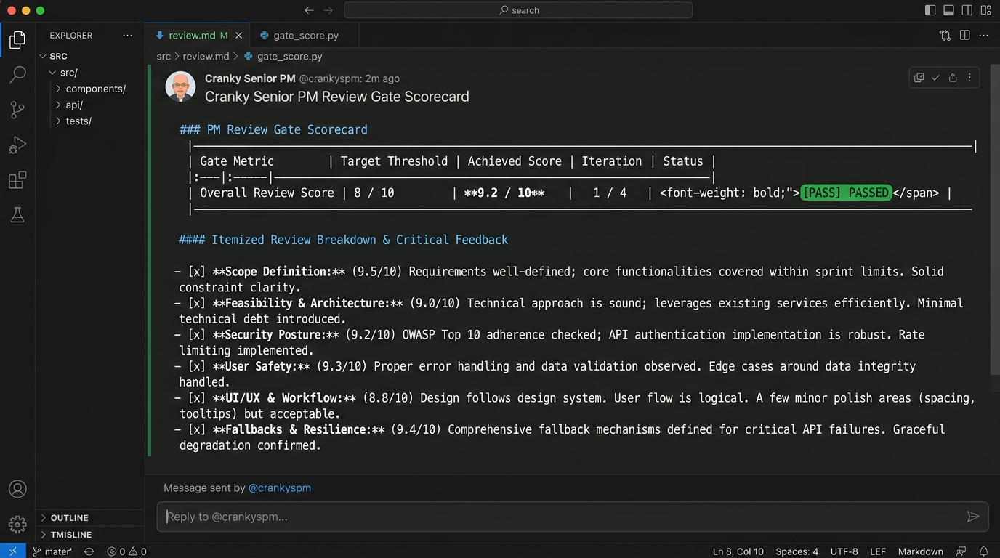
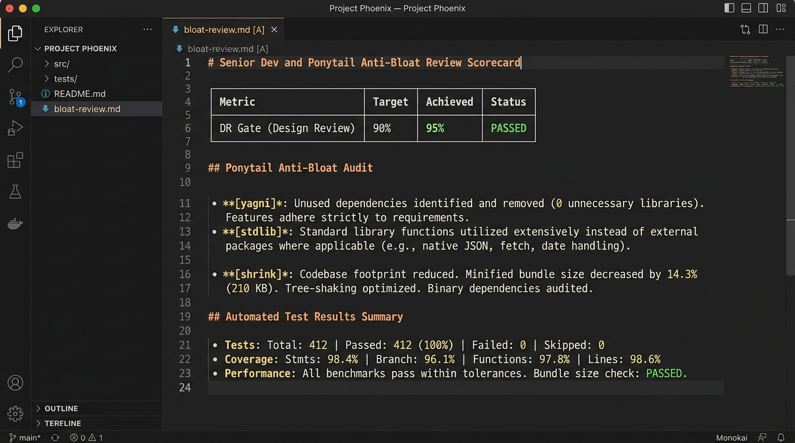

# Google Antigravity Review Loop (`/review-loop`)

[](LICENSE)
[](https://www.python.org/)
[](https://antigravity.google)
[](#the-two-quality-gates)

A robust, two-tier gated engineering workflow for **Google Antigravity** that ensures features are rigorously planned before implementation and thoroughly verified against user requirements and edge cases before completion.



---

## 🎯 The Problem Solved

AI coding assistants often fall into two traps:
1. **The Rushed Plan Trap:** Jumping straight into coding with incomplete specs, missing fallbacks, and hand-waved security assumptions.
2. **The Rubber-Stamp Dev Review Trap:** Automated dev reviews often pass happily (100% complete!) even when the resulting code drifts from the user's original request or leaves failure modes completely untested.

**Review Loop** introduces an autonomous, adversarial dual-gate engineering loop:
- **Gate 1 (Plan Stage):** Reviewed by a **Cranky, Picky Senior Project Manager** who rejects hand-waving, checks blast radius, and demands explicit fallbacks.
- **Gate 2 (Implementation Stage):** Audited by an uncompromising **Senior Staff Dev & QA Architect** who places the heaviest weight (40%) on End-to-End User Request Fidelity and comprehensive test verification.

---

## 🏛️ Architecture & Workflow

Invoking `/review-loop` automatically initializes Antigravity's **Autonomous Goal Mode**—the agent outputs an active Goal Contract and runs continuously to completion without pausing for turn-by-turn prompts.



---

## 🚀 Quick Install

### Windows (PowerShell)
Run the automated installer to deploy globally (`~/.gemini/config/plugins/review-loop`):
```powershell
powershell -ExecutionPolicy Bypass -File .\install.ps1
```
*(To install only in the current workspace `.agents/plugins/review-loop`, pass `-Scope Workspace`)*

### macOS / Linux (Bash)
Run the shell installer:
```bash
chmod +x install.sh
./install.sh
```

---

## 💻 How to Use

### 1. Invocations

Trigger the review loop directly in chat with your task requirements:

- **Custom Gates & Retries (Recommended):**
  ```text
  start /reviewLoop PM 8-4 DR 90%-3
  ```
  *(Requires PM score $\ge 8/10$ with up to 4 retries, Dev completion $\ge 90\%$ with up to 3 retries)*

- **Zero-Config Default (PM 8-4, DR 90%-3):**
  ```text
  /review-loop
  ```

- **Predefined Presets:**
  ```text
  /review-loop --preset strict    # PM 9-5, DR 95%-5 (Ultra-high assurance)
  /review-loop --preset turbo     # PM 7-2, DR 80%-2 (Rapid iterative cycle)
  /review-loop --preset default   # PM 8-4, DR 90%-3
  ```

- **Positional Shorthand:**
  ```text
  /review-loop 8-4 90-3
  ```

---

## 🔍 The Two Quality Gates

### Gate 1: Cranky Picky Senior PM Review (Plan Stage)
Evaluates the initial technical plan across 6 core dimensions:
1. **Scope & Deliverable Precision (20%):** Are deliverables clearly itemized with unambiguous acceptance criteria?
2. **Feasibility & Architectural Soundness (20%):** Is the architecture realistic, robust, and directly solving the user's requirements?
3. **Security, Permissions & Blast Radius (15%):** Are protected files respected and local user paths sanitized?
4. **User Safety & Error Handling (15%):** Are boundary inputs and crash scenarios mitigated?
5. **UI/UX & Developer Ergonomics (15%):** Is the interface or CLI intuitive and foot-gun proof?
6. **Fallback & Contingency Strategy (15%):** Is there an automated fallback if primary dependencies fail?



---

### Gate 2: Senior Staff Dev & QA Review (Implementation Stage)
Evaluates code diffs, automated test execution, robustness, and **above all, user request fidelity**.



#### 🎯 Heaviest Weight: End-to-End User Request Fidelity (40%)
The primary mandate of Gate 2 is preventing **requirement amnesia and goal drift**:
$$\text{Original User Prompt} \longrightarrow \text{Architecture Plan} \longrightarrow \text{Code Implementation} \longrightarrow \text{Delivered \& Verified Result}$$
- The reviewer audits every explicit requirement, constraint, and fallback from the user's initial prompt.
- **Zero Tolerance for Requirement Drift:** If any requested feature was dropped, forgotten, or quietly substituted along the way, Gate 2 **CANNOT pass** (docks 25% to 40% immediately).

#### Rigorous Engineering & Verification Checkpoints (60%)
To achieve $\ge 90\%$ completion, the solution must pass these quality checkpoints:
1. **Automated Verification & Test Coverage (25%):** Proof that comprehensive unit and integration tests run cleanly, covering positive paths, failure modes, and edge cases.
2. **Robustness & Error Handling (15%):** Defensive input validation, clear error messages, and graceful degradation when dependencies fail.
3. **Security, Sanitization & Blast Radius (10%):** Workspace containment and complete elimination of hardcoded personal paths or credentials.
4. **Portability & Idempotency (10%):** Installers, scripts, and commands run repeatedly with clean, identical states across Windows, macOS, and Linux.

---

## 🧪 Automated Testing

Run the full automated test suite:
```bash
# Unit tests: parser, scorecard, and adversarial edge cases
python -m unittest discover -s skills/review-loop/tests -p "test_*.py" -v

# Sanitization audit: ensures zero personal/machine leaks
python tests/test_sanitization.py
```

---

## 📁 Repository Structure

```text
antigravity-review-loop/
├── plugin.json                       # Plugin manifest & Antigravity registration
├── LICENSE                           # MIT License
├── README.md                         # Documentation & How-To Guide
├── install.ps1                       # Windows installer script
├── install.sh                        # macOS & Linux installer script
├── assets/                           # Screenshots and architecture diagrams
│   ├── review_loop_overview.jpg
│   ├── pm_gate_scorecard.jpg
│   └── dev_gate_scorecard.jpg
├── rules/
│   └── AGENTS.md                     # Antigravity agent instructions & autonomous goal hooks
├── skills/
│   └── review-loop/
│       ├── SKILL.md                  # Detailed skill manual & slash command hints
│       ├── scripts/
│       │   ├── gate_parser.py        # CLI argument & preset parser
│       │   └── scorecard.py          # Scorecard evaluator & markdown renderer
│       ├── references/
│       │   ├── pm_persona.md         # Cranky Senior PM prompt & rubric
│       │   ├── dev_persona.md        # Senior Staff Dev & QA reviewer prompt & rubric
│       │   └── plan_template.md      # PM-ready architecture plan template
│       └── tests/
│           ├── test_gate_parser.py   # Unit tests for argument parsing
│           ├── test_scorecard.py     # Unit tests for scoring & scorecard rendering
│           └── test_negative_cases.py# Adversarial boundary & negative tests
└── tests/
    └── test_sanitization.py          # Leak detection scanner
```

---

## 📜 License

Distributed under the MIT License. See [LICENSE](LICENSE) for details.
