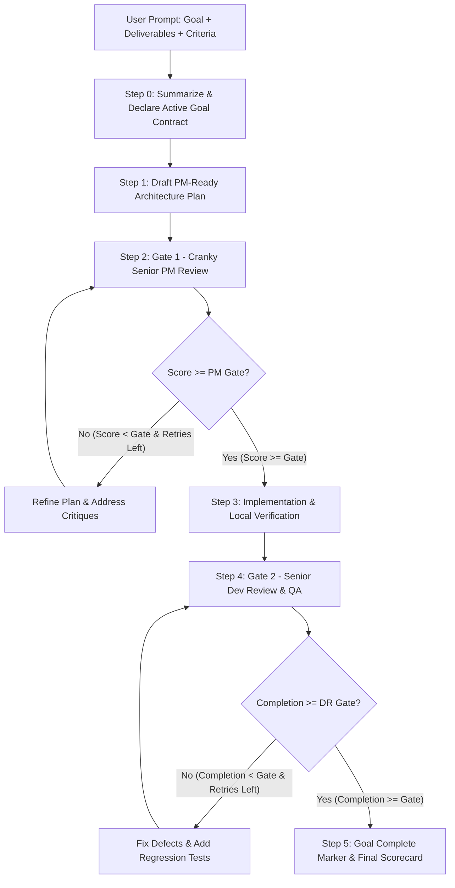

# Review Loop: Two-Tier Gated Engineering Workflow

The **Review Loop** skill enforces an autonomous, iterative quality-control protocol designed to guarantee that solutions are thoroughly architected before implementation and rigorously verified before completion.

> [!TIP]
> **Built-In Antigravity Goal Mode:**  
> Invoking `/reviewLoop` or `/review-loop` automatically initializes Antigravity Autonomous Goal mode. You do **not** need to call `/goal` separately! The agent automatically summarizes the Goal Contract, adopts an autonomous run-to-completion posture through both review gates, and concludes with `<!-- GOAL_COMPLETE -->`.

---

## 🎯 When to Use This Skill

Activate this skill when the user:
- Types `/reviewLoop`, `/review-loop`, `start /reviewLoop`, or `/gate-loop`
- Specifies a review gate format like `PM 8-4 DR 90%-3` or `PM 9-5 DR 95%-5`
- Asks for a goal using the pattern: *"State goal -> plan -> PM review -> implement -> senior dev review"*

---

## ⚙️ Gate Configuration & Syntax

The user can configure target gate thresholds and retry limits flexibly:

| Invocation Syntax | PM Gate (Plan Review) | DR Gate (Dev Review) | Description |
| :--- | :---: | :---: | :--- |
| `start /reviewLoop PM 8-4 DR 90%-3` | Score $\ge 8/10$ (Max 4 retries) | Completion $\ge 90\%$ (Max 3 retries) | Standard user format |
| `/review-loop` | Score $\ge 8/10$ (Max 4 retries) | Completion $\ge 90\%$ (Max 3 retries) | Default configuration |
| `/review-loop --preset strict` | Score $\ge 9/10$ (Max 5 retries) | Completion $\ge 95\%$ (Max 5 retries) | Ultra-high assurance |
| `/review-loop --preset turbo` | Score $\ge 7/10$ (Max 2 retries) | Completion $\ge 80\%$ (Max 2 retries) | Fast iterative mode |
| `/review-loop 8-4 90-3` | Score $\ge 8/10$ (Max 4 retries) | Completion $\ge 90\%$ (Max 3 retries) | Positional shorthand |

### Parameter Parser
To parse user arguments quickly and reliably, run the bundled parser:
```bash
python .agents/plugins/review-loop/skills/review-loop/scripts/gate_parser.py "<user_args>"
```

---

## 🔁 Workflow Execution Protocol



---

### Step 0: Summarize & Declare the Active Goal Contract
Immediately output a structured **Goal Declaration** in chat to anchor the session:
- **Goal Statement:** Clear 1–2 sentence declaration of the target objective.
- **Deliverables Checklist:** Concrete, numbered deliverables.
- **Success Criteria & Fallbacks:** Explicit acceptance metrics and fallback guarantees.
- **Configured Review Gates:** Target PM score + retries, and target Dev Review completion % + retries.
- **Autonomous Posture:** Inform the user that execution is running autonomously end-to-end.

---

### Step 1: Draft PM-Ready Architecture Plan
Draft an implementation plan following [`references/plan_template.md`](references/plan_template.md):
- Address architecture, dependencies, security boundaries, user ergonomics, edge cases, and fallback strategies.

---

### Step 2: Gate 1 — Cranky Senior PM Review Subagent
1. Spawn or invoke a review subagent (or run an evaluation turn) adopting the persona in [`references/pm_persona.md`](references/pm_persona.md):
   - **Persona**: Uncompromising, experienced Senior Project Manager.
   - **Rubric (1-10)**: Scope Precision, Technical Feasibility, Security & Blast Radius, User Safety & Errors, UI/UX Ergonomics, Fallback Strategy.
2. The subagent returns an `OVERALL_SCORE: X/10` and itemized critiques.
3. Evaluate the result:
   ```bash
   python .agents/plugins/review-loop/skills/review-loop/scripts/scorecard.py --phase pm --score <SCORE> --gate <PM_GATE> --iteration <ITERATION> --max-retries <PM_RETRIES>
   ```
4. **Decision Loop**:
   - **If Score $\ge$ PM Gate**: Pass Gate 1. Proceed immediately to Step 3.
   - **If Score < PM Gate and Retries Remain**: Review critiques, revise the plan line-by-line, increment iteration, and re-submit to Gate 1.
   - **If Retries Exhausted**: Proceed with best-effort implementation, alerting the user to residual risks.

---

### Step 3: Implementation & Local Verification
1. Execute the approved plan:
   - Create or modify the necessary files.
   - Write automated unit and integration tests.
   - Stay strictly within workspace boundaries (respecting Guardian / Approve for Me rules).
2. Run tests to confirm zero syntax errors and green test runs:
   ```bash
   npm test   # or python -m unittest / pytest / cargo test
   ```

---

### Step 4: Gate 2 — Senior Staff Dev & QA Review Subagent
1. Spawn or invoke a review subagent adopting the persona in [`references/dev_persona.md`](references/dev_persona.md):
   - **Persona**: Uncompromising Senior Staff Dev & QA Architect.
   - **🎯 Primary Checkpoint (Heaviest Weight: 40%) — User Request Fidelity & Lineage:**
     - Traces: `[User Request] ──> [Architecture Plan] ──> [Code Implementation] ──> [Delivered & Verified Result]`
     - Validates that 100% of the user's explicit ask made it through the entire development cycle into the actual delivered results.
     - **Zero Tolerance for Requirement Drift:** If any requirement was dropped, forgotten, or quietly substituted, docks **25% to 40%** immediately, failing the gate.
   - **Quality & Verification Criteria:**
     - *Automated Verification & Tests (25%):* Comprehensive unit and integration test suites covering positive paths and failure boundaries.
     - *Robustness & Error Handling (15%):* Clear diagnostic messages, input validation, and graceful degradation.
     - *Security & Sanitization (10%):* Workspace containment and zero hardcoded personal paths.
     - *Portability & Idempotency (10%):* Repeatable, clean execution across Windows, macOS, and Linux.
   - **Rubric Breakdown**: User Request Fidelity (40%), Automated Verification (25%), Robustness & Error Handling (15%), Security & Sanitization (10%), Portability & Idempotency (10%).
2. The subagent inspects code diffs and test logs, returning a `PERCENTAGE_COMPLETE: X%`, user request lineage table, and deficiency list.
3. Evaluate the result:
   ```bash
   python .agents/plugins/review-loop/skills/review-loop/scripts/scorecard.py --phase dr --score <PERCENTAGE> --gate <DR_GATE> --iteration <ITERATION> --max-retries <DR_RETRIES>
   ```
4. **Decision Loop**:
   - **If Percentage $\ge$ DR Gate**: Pass Gate 2. Proceed to Step 5.
   - **If Percentage < DR Gate and Retries Remain**: Implement missing user requirements, fix defects, add missing tests, increment iteration, and re-submit to Gate 2.
   - **If Retries Exhausted**: Document completed vs deferred items and flag for user inspection.

---

### Step 5: Final Scorecard & Goal Complete Seal
1. Output the comprehensive final scorecard summarizing:
   - Gate 1 (PM Review): Final score, iterations used, status.
   - Gate 2 (Dev Review): Final completion percentage, test count, status.
   - Verified Deliverables checklist.
2. Output `<!-- GOAL_COMPLETE -->` to signal terminal completion to the Antigravity engine.
